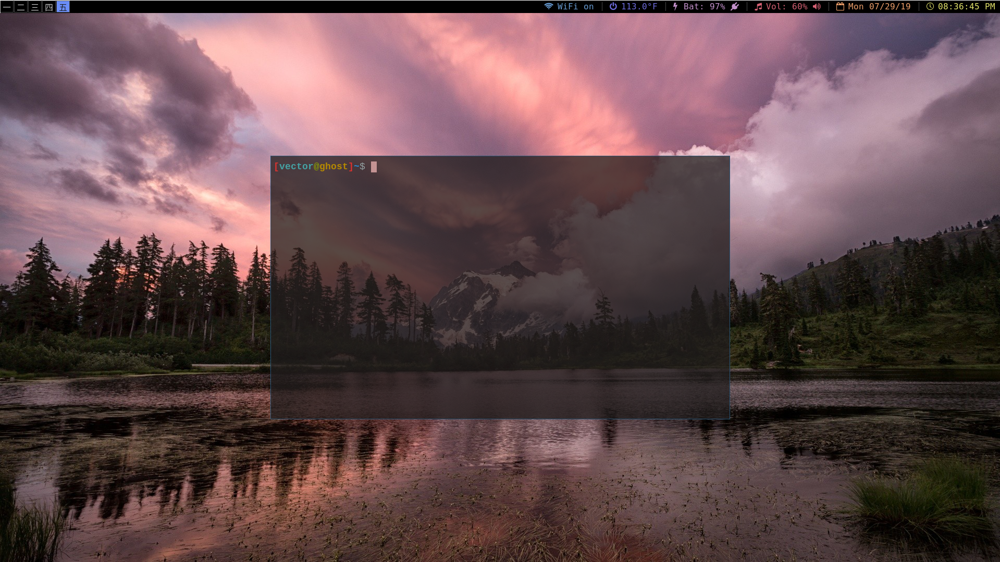

# st


Fork of [suckless terminal (st)](https://st.suckless.org/) with configurations from [Luke Smith](https://github.com/LukeSmithxyz/st) w/ personal preferences for colors/transparency.

## Compilation/installation
```
make clean
sudo make install
```

On first installation, you can copy the executable file named "st" to /usr/local/bin using `cp st /usr/local/bin`

For easier future usage or use in i3 config, set a variable `export $TERMINAL="st"` in ~/.profile. 

